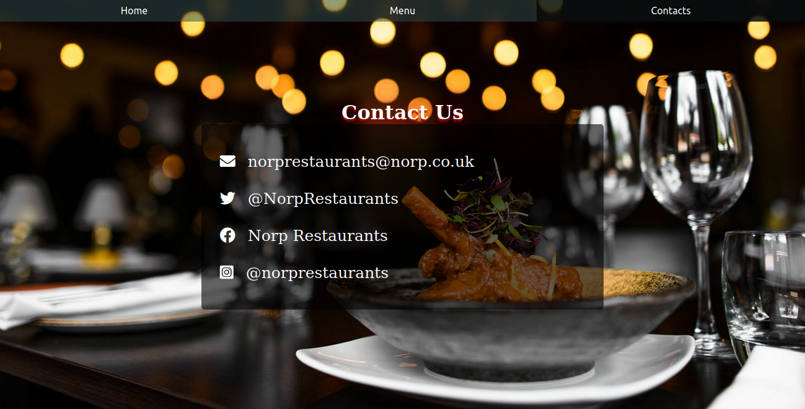

# Restaurant

## Project Description

This project is a simple restaurant homepage designed to demonstrate my understanding of the fundamentals and concepts of ECMAScript6(ES6), Node Package Manager(npm) and Webpack.

It involves practicing DOM manipulation to dynamically render the page by using Javascript alone to generate the entire contents of the website.

The project has 3 tabs, each displaying different contents about the restaurant.

### Screenshots

##  🔧 Built with

- HTML5

- CSS3
- Javascript
- Node Package Manager (npm)
- Webpack

## 🔴 Live Demo

**Coming soon**

## Get started
### Prerequisites
1. Node Package Mangaer(npm) should be installed on your local machine.

### Steps to follow
1. Clone the repository to your local machine using `git clone git@github.com:RNtaate/Restaurant.git`

1. On your local machine, navigate to the Restaurant folder using `cd Restaurant` in your terminal

1. Run `npm install` to install all the necessary dependencies.

1. Run `npm run build`

1. Open the `index.html` file in your favorite browser, or copy its file path and paste it in your favorite browser.

## 🤝 Contributions
  There are two ways of contributing to this project:

1. If you see something wrong or not working, please check [the issue tracker section](https://github.com/RNtaate/Restaurant/issues), if that problem you met is not in already opened issues then open the issue by clicking on `new issue` button.

2. If you have a solution to that, and you are willing to work on it, follow the below steps to contribute:
    1.  Fork this repository

    1.  Clone it on your local computer by running `git clone git@github.com:RNtaate/Restaurant.git` __Replace *RNtaate* with the username you use on github__
    1.  Open the cloned repository which appears as a folder on your local computer with your favorite code editor
    1.  Create a separate branch off the *master branch*,
    1.  Write your codes which fix the issue you found
    1.  Commit and push the branch you created
    1.  Raise a pull request, comparing your new created branch with our original master branch [here](https://github.com/RNtaate/Restaurant)

## ✒️  Authors

👤 **Roy Ntaate**

- Github: [@RNtaate](https://github.com/RNtaate)
- Twitter: [@RNtaate](https://twitter.com/RNtaate)
- Linkedin: [roy-ntaate](https://linkedin.com/in/roy-ntaate)

## Show your support

Give a ⭐️ if you like this project!

## Acknowledgements

- This project was originally taken from [the Odin project](https://www.theodinproject.com/courses/javascript/lessons/restaurant-page).

- This project was inspired by the [Microverse](https:www.microverse.org) program